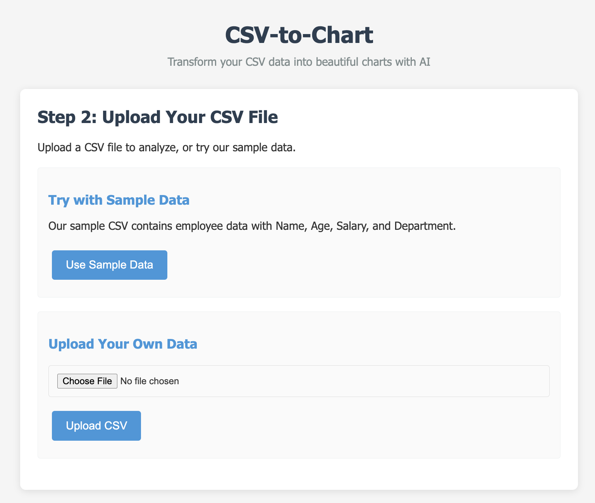
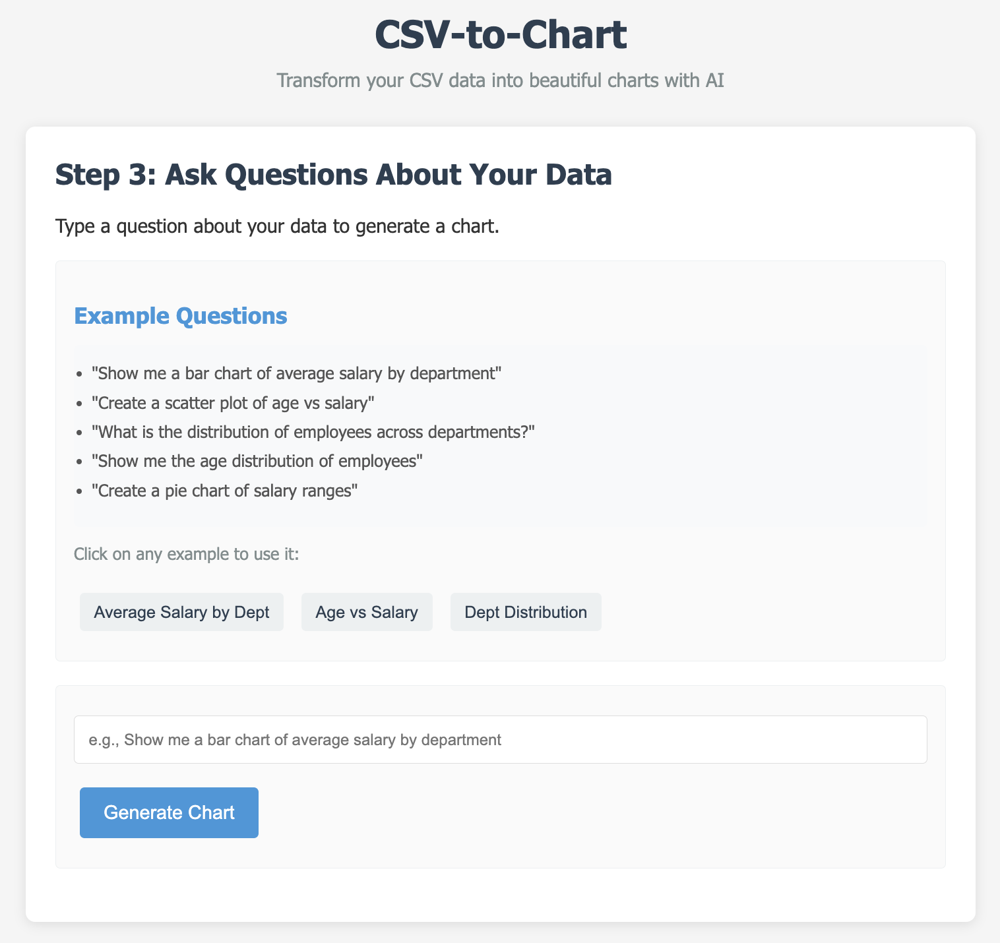
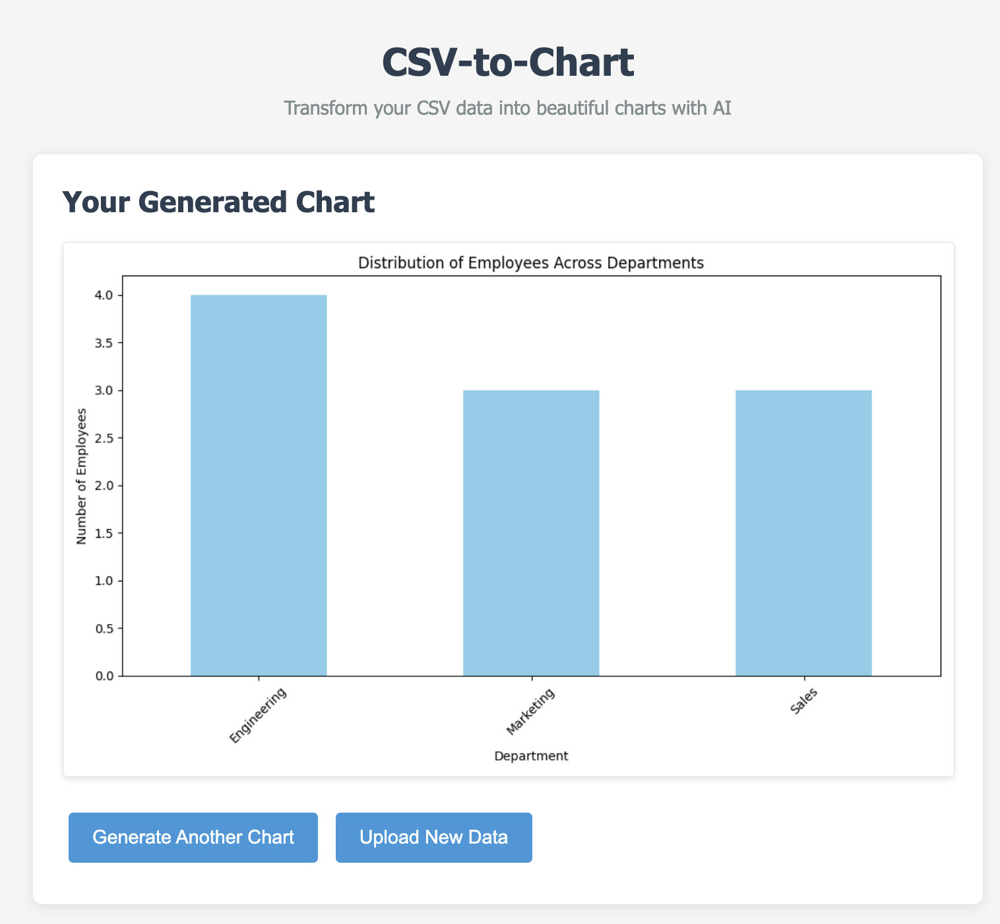

# CSV-to-Chart

[](https://www.python.org/downloads/)
[](https://opensource.org/licenses/MIT)

A web application that converts CSV data to charts using AI. Upload your CSV file, provide your OpenRouter API key, ask questions about your data, and get visual charts generated automatically.

## Screenshots

<table>
  <tr>
    <td></td>
    <td></td>
    <td></td>
  </tr>
  <tr>
    <td align="center">Step 1: Enter API Key</td>
    <td align="center">Step 2: Upload Data or Use Sample</td>
    <td align="center">Step 3: Ask Questions and View Charts</td>
  </tr>
</table>

## Features

- 📊 **AI-Powered Chart Generation**: Transform your CSV data into beautiful visualizations using AI
- 🖱️ **User-Friendly Interface**: Simple step-by-step workflow with clear instructions
- 💡 **Smart Suggestions**: Example questions to help you get started quickly
- 📁 **Sample Data Included**: Try it out immediately with our sample dataset
- 🔐 **Secure API Key Handling**: API keys are stored locally in your browser
- 🌐 **Responsive Design**: Works on desktop and mobile devices

## Prerequisites

- Python 3.12 or higher
- An OpenRouter API key (free to sign up at [openrouter.ai](https://openrouter.ai/))

## Installation

1. Clone the repository:
   ```bash
   git clone https://github.com/your-username/csv-to-chart.git
   cd csv-to-chart
   ```

2. Create a virtual environment (optional but recommended):
   ```bash
   python -m venv venv
   source venv/bin/activate  # On Windows use `venv\Scripts\activate`
   ```

3. Install the required dependencies:
   ```bash
   pip install -r requirements.txt
   ```

   Or if you're using the pyproject.toml file:
   ```bash
   pip install .
   ```

## Quick Start

1. Start the application:
   ```bash
   python app.py
   ```

2. Open your web browser and navigate to `http://localhost:5001`

3. Follow the 3-step process:
   - Enter your OpenRouter API key
   - Upload a CSV file or use our sample data
   - Ask questions about your data to generate charts

## How It Works

1. **Enter API Key**: Provide your free OpenRouter API key (get one at [openrouter.ai](https://openrouter.ai/))
2. **Upload Data**: Upload your CSV file or try with our sample employee data
3. **Ask Questions**: Use natural language to query your data
4. **Get Charts**: AI generates beautiful matplotlib charts based on your questions
5. **View Results**: Charts are displayed instantly in your browser

## Example Questions

Try these example questions with our sample data:

- "Show me a bar chart of average salary by department"
- "Create a scatter plot of age vs salary"
- "What is the distribution of employees across departments?"
- "Show me the age distribution of employees"
- "Create a pie chart of salary ranges"

## Project Structure

```
csv-to-chart/
├── app.py              # Main Flask application
├── requirements.txt    # Python dependencies
├── pyproject.toml      # Project configuration
├── sample.csv          # Sample data file
├── .gitignore          # Git ignore file
├── .python-version     # Python version specification
├── README.md           # This file
├── LICENSE             # MIT License
├── static/             # Static files (CSS, images)
│   └── style.css       # Application styling
└── templates/          # HTML templates
    └── index.html      # Main application page
```

## Configuration

1. Sign up for a free API key at [OpenRouter](https://openrouter.ai/):
   - Go to https://openrouter.ai/
   - Click "Sign Up" and create an account
   - Navigate to the "Keys" section to generate an API key
   - Copy your API key

2. No need to set environment variables! The application accepts your API key directly through the web interface.

## Error Handling

The application includes comprehensive error handling for:
- Missing or invalid API keys
- Invalid file uploads
- Empty or malformed CSV files
- Errors in AI-generated code
- Network issues with the AI service

## Troubleshooting

1. **API Authentication Error (401)**:
   - Verify that you have entered a valid OpenRouter API key
   - Ensure your API key has not expired
   - Check that you haven't included extra spaces in the key

2. **"Failed to extract Python code from AI response"**:
   - This may happen if the AI model is not generating code properly
   - Try rephrasing your question to be more specific
   - Check that your CSV file has the expected structure

3. **Generated chart is not displayed**:
   - Refresh the page to clear browser cache
   - Check that the `static/chart.png` file was created
   - Verify that the web server has write permissions to the `static` directory

4. **CSV file upload issues**:
   - Ensure your file has a `.csv` extension
   - Check that the file is not empty
   - Verify that the file follows proper CSV formatting

## Development

To contribute to this project:

1. Fork the repository
2. Create a new branch for your feature
3. Make your changes
4. Test thoroughly
5. Submit a pull request

## License

This project is licensed under the MIT License - see the [LICENSE](LICENSE) file for details.

## Acknowledgments

- [Flask](https://flask.palletsprojects.com/) - Web framework
- [Pandas](https://pandas.pydata.org/) - Data manipulation
- [Matplotlib](https://matplotlib.org/) - Chart generation
- [OpenRouter](https://openrouter.ai/) - AI model access
- [DeepSeek](https://www.deepseek.com/) - AI model provider

## Support

If you encounter any issues or have questions, please [open an issue](https://github.com/your-username/csv-to-chart/issues) on GitHub.
